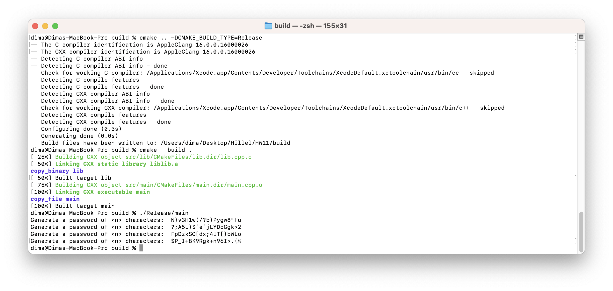

List of commands that need to be executed sequentially to build the project

1) cd ../HW11
2) mkdir build && cd build
3) 

prepare files to be compiled via cmake
files will be created in HW11/build/Release/

cmake .. -DCMAKE_BUILD_TYPE=Release 

cmake --build .

Or if you need to generate a project file for Xcode, then one command is executed

cmake -G "Xcode" ..

